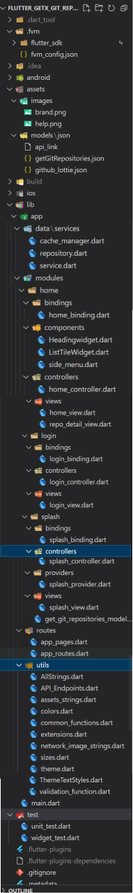
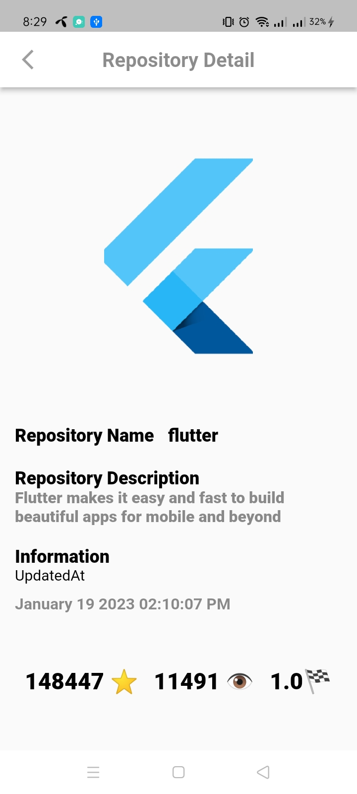
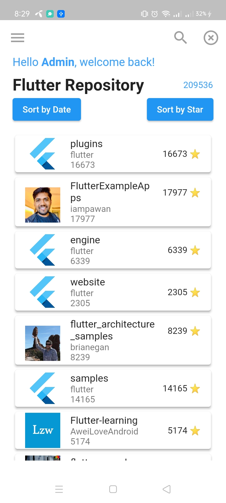
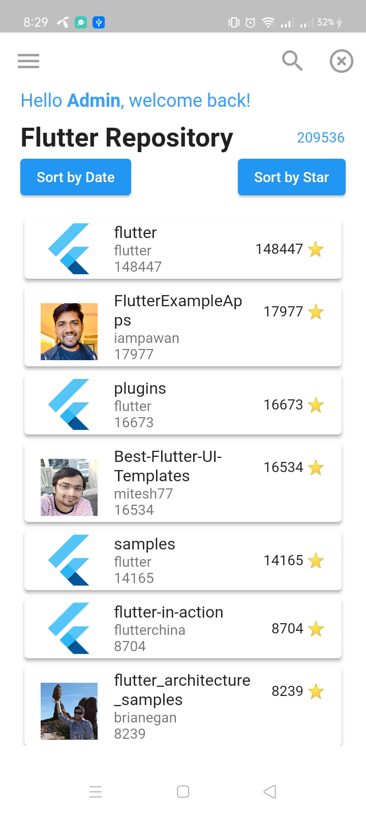

# Project Title
BS23 flutter task 101

A brief description of what this project does and who it's for

email anik@gmail.com
password 12345
## Tasks

1. Fetch repository list from GitHub API using "Flutter" as query keyword. (API doc)
https://github.com/mosfeqanik/flutter_getx_git_repositories/blob/master/lib/app/modules/splash/controllers/splash_controller.dart
2. The fetched data should be stored in a local database to permit the app to be used in offline mode.


yes done at splash_controller onInit getGitRepositories Getx Getconnect get storage

https://github.com/mosfeqanik/flutter_getx_git_repositories/blob/master/lib/app/modules/splash/controllers/splash_controller.dart


3. Fetching the repository list should be paginated by scrolling. Each time by scrolling, fetch 10 new items.

i think so that pagination per page is not working  https://api.github.com/search/repositories?q={Flutter}{&page,per_page,sort,order}


so i fetch all data and showed it by 10
done at home_controller onInit fetchdataBypagination

https://github.com/mosfeqanik/flutter_getx_git_repositories/blob/master/lib/app/modules/home/controllers/home_controller.dart

4. The required data can be refreshed from the API no more frequently than once every 30 minutes.

https://github.com/mosfeqanik/flutter_getx_git_repositories/blob/master/lib/app/modules/home/controllers/home_controller.dart

5. Show the list of repositories on the home page.


yes done at home_controller onInit

https://github.com/mosfeqanik/flutter_getx_git_repositories/blob/master/lib/app/modules/home/views/home_view.dart


6. List can be sorted by either the last updated date-time or star count (add a sorting button/icon)


yes done at home_controller sortByDate and sortByStar

https://github.com/mosfeqanik/flutter_getx_git_repositories/blob/master/lib/app/modules/home/controllers/home_controller.dart

7. Selected sorting option persists in further app sessions.

yes done at home_controller loadGitDetailsData

https://github.com/mosfeqanik/flutter_getx_git_repositories/blob/master/lib/app/modules/home/controllers/home_controller.dart

8. A repo details page, which is navigated by clicking on an item from the list.

by passing object to repo__detail

https://github.com/mosfeqanik/flutter_getx_git_repositories/blob/master/lib/app/modules/home/views/repo_detail_view.dart


9. Details page shows repo owner's name, photo, repository's description, last update date time in month-day-year hour:seconds format, each field in 2 digit numbers and any  other fields you want

yes added for date used  intl

https://github.com/mosfeqanik/flutter_getx_git_repositories/blob/master/lib/app/utils/common_functions.dart

https://github.com/mosfeqanik/flutter_getx_git_repositories/blob/master/lib/app/modules/home/views/repo_detail_view.dart

10. The repository list and repository details data that loaded once, should be saved for offline browsing.


https://github.com/mosfeqanik/flutter_getx_git_repositories/blob/master/lib/app/modules/home/controllers/home_controller.dart

11. Unit Testing coverage.

yes for one function

https://github.com/mosfeqanik/flutter_getx_git_repositories/blob/master/test/unit_test.dart
12. Any popular State management tool such as Bloc, GetX, RxDart, etc.

yes used Getx RxDart

13. Dependency Injection framework.

yes at setUpTimedFetch

https://github.com/mosfeqanik/flutter_getx_git_repositories/blob/master/lib/app/modules/home/controllers/home_controller.dart
14. Repository pattern with an appropriate abstraction layer.


used in common function

https://github.com/mosfeqanik/flutter_getx_git_repositories/blob/master/lib/app/utils/common_functions.dart


15. Right now there is no need for adding auth tokens with API calls. But you can
    implement the way to handle it for the future. Also can add some retry mechanism when
    the API fails. 
    
yes token handling is added 

at splash controller and cache manager tokenAvailabilityCheck

https://github.com/mosfeqanik/flutter_getx_git_repositories/blob/master/lib/app/modules/splash/controllers/splash_controller.dart
https://github.com/mosfeqanik/flutter_getx_git_repositories/blob/master/lib/app/data/services/cache_manager.dart

used packages

 #getx StateManagement
 
 get: 4.6.5
 #getx storage chache management
 
 
 get_storage: ^2.0.3
 
 #date and other formatter
 
 intl: ^0.17.0
 
 #splash page image
 
 lottie: ^2.2.0
 
 #drawer icons
 
 ternav_icons: ^1.0.0
 
 #responsive usage
 
 flutter_screenutil: ^5.6.0
 
 #network image chache management
 
 cached_network_image: ^3.2.3
 
 APK link
https://github.com/mosfeqanik/flutter_getx_git_repositories/blob/master/apk/app-release.apk
 
</img>

```
    lib
    ├── app
    │   ├── data
    │   │   └── services
    │   │          └── local_storage.dart
    │   ├── utils
    │   │   └── (...)
    │   ├── services
    │   │   └── local_storage.dart
    │   └── routes
    │       ├── app_pages.dart
    │       └── app_routes.dart
    ├── modules
    │   ├── home
    │   │   ├── bindings
    │   │   ├── components
    │   │   ├── controllers
    │   │   └── views
    │   ├── login
    │   │   ├── bindings
    │   │   ├── components
    │   │   ├── controllers
    │   │   └── views
    │   ├── splash
    │   │   ├── bindings
    │   │   ├── providers
    │   │   ├── components
    │   │   ├── controllers
    │   │   └── views
    │   └── app.dart
    ├── generated_plugin_registrant.dart
    └── main.dart
```

</img>
</img>
</img>
</img>
</img>

;
;
